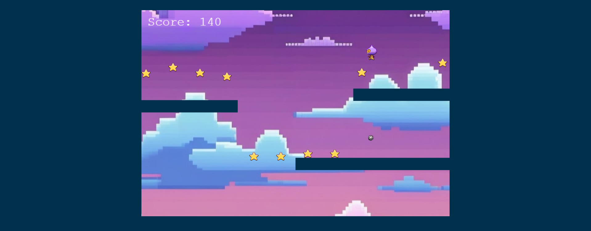
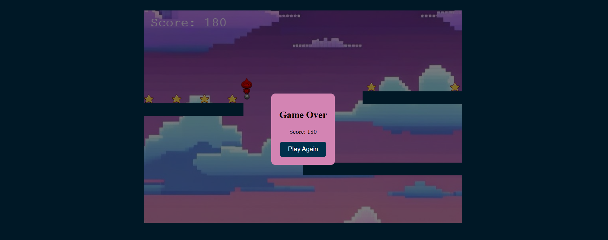

# Birdie Bounce: Juego de Plataformas

Este es un juego de plataformas desarrollado siguiendo el tutorial de Phaser, utilizando **HTML**, **CSS** y **JavaScript**. En este juego, el jugador controla a un pequeño personaje, _Dude_, que debe brincar a través de plataformas, recolectar estrellas y esquivar una bomba para ganar puntos. El juego incluye un menú de _Game Over_, donde el jugador puede optar por volver a intentarlo y mejorar su puntuación.

Tutorial original: [Phaser Game Tutorial](https://phaser.io/tutorials/making-your-first-phaser-3-game/)

## Descripción del Juego

_Birdie Bounce_ es un desafiante juego de plataformas en el que el objetivo es ayudar a _Dude_ a recolectar estrellas y esquivar bombas, mientras se mueve a través de plataformas flotantes.

- **Control del personaje**: Usa las teclas de dirección para mover a _Dude_ de un lado a otro.
- **Objetivo**: Recolecta todas las estrellas que puedas para aumentar tu puntuación, evitando las bombas que aparecen en el camino.
- **Dificultad progresiva**: Las bombas y plataformas están ubicadas de manera estratégica para hacer el juego más desafiante. Cada vez que recoges todas las estrellas aparece una nueva bomba y aumenta la dificultad.

## Cómo Jugar

1. **Inicia el juego** para comenzar a brincar a través de las plataformas.
2. **Controla a _Dude_** usando las teclas de dirección para esquivar la bomba.
3. **Recolecta estrellas** para aumentar tu puntuación mientras intentas mantenerte en movimiento.
4. **Evita la bomba**: Si tocas la bomba, el juego terminará y verás la pantalla de _Game Over_, donde podrás optar por volver a jugar.

## Funcionalidades Adicionales

- **Menú de Game Over**: Cuando el jugador toca la bomba, aparece un menú de _Game Over_ que permite reiniciar el juego con un solo clic, brindando la oportunidad de mejorar la puntuación.

## Capturas de Pantalla

### Pantalla de Juego

### Pantalla de Game Over

## Tecnologías Utilizadas

- **HTML**: Estructura del juego.
- **CSS**: Estilizado del juego y diseño responsive.
- **JavaScript**: Lógica del juego, detección de colisiones y manejo de la puntuación.

---

¡Intenta recolectar todas las estrellas mientras esquivas la bomba y desafía tu propia puntuación! 🎮
